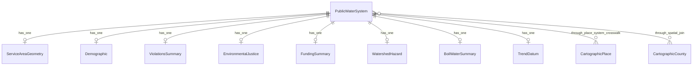

# Database Schema

> Rails-idiomatic schema for the Drinking Water Explorer. All tables use proper types — the legacy schema stored everything as TEXT.

---

## Entity Relationships

`pwsid` is the universal join key — a string like `"OH0100013"` (2-letter state + 7-digit ID). It serves as the primary key on `public_water_systems` and as a foreign key on every associated table.

---

## Tables

### `public_water_systems`

The central table. One row per public water system. Combines columns from the legacy `epa_sabs` and `sdwis_viols` tables (the non-violation columns).

| Column | Type | Nullable | Indexed | Notes |
|--------|------|----------|---------|-------|
| `pwsid` | `string` | no | PK | Format: `"XX0000000"` — state abbreviation + 7 digits |
| `pws_name` | `string` | yes | | System name |
| `stusps` | `string(2)` | yes | btree | State USPS abbreviation |
| `primacy_agency` | `string` | yes | | Regulatory agency name |
| `pop_cat_5` | `string` | yes | btree | EPA population category (Very Small / Small / Medium / Large / Very Large) |
| `population_served_count` | `integer` | yes | | Number of people served |
| `service_connections_count` | `integer` | yes | | Number of service connections |
| `service_area_type` | `string` | yes | | "System Sourced" or "Modeled" |
| `symbology_field` | `string` | yes | | Map display category |
| `gw_sw_code` | `string` | yes | btree | "Groundwater" or "Surface Water" |
| `primary_source_code` | `string` | yes | | Detailed source type code |
| `owner_type` | `string` | yes | btree | Federal / State / Local / Native American / Private / Public/Private |
| `primacy_type` | `string` | yes | btree | State / Tribal / Territory |
| `years_operating` | `integer` | yes | | Years since first reported |
| `first_reported_date` | `string` | yes | | Date first reported to EPA (kept as string — format varies in source) |
| `is_wholesaler` | `boolean` | yes | | Sells water wholesale to other systems |
| `is_school_or_daycare` | `boolean` | yes | | Serves a school or daycare |
| `is_grant_eligible` | `boolean` | yes | | Eligible for EPA grants |
| `source_water_protection_code` | `string` | yes | | Source water protection status |
| `open_health_viol` | `string` | yes | | "Yes" / "No" — currently open health-based violations |
| `phone_number` | `string` | yes | | Contact phone number |
| `detailed_facility_report` | `string` | yes | | URL to EPA facility report |
| `ewg_report_link` | `string` | yes | | URL to EWG report |
| `area_sq_miles` | `decimal` | yes | | Service area in square miles |
| `counties` | `text` | yes | | Semicolon-delimited list of counties (denormalized from spatial join) |

---

### `service_area_geometries`

PostGIS geometries for each water system. Merges the legacy `epa_sabs_geoms` (polygons) and `epa_sabs_points` (centroids) into one table.

| Column | Type | Nullable | Indexed | Notes |
|--------|------|----------|---------|-------|
| `id` | `bigint` | no | PK | Auto-increment |
| `pwsid` | `string` | no | btree, unique | FK to `public_water_systems` |
| `geom` | `geometry(MultiPolygon, 4326)` | yes | GiST | Service area boundary |
| `centroid` | `geometry(Point, 4326)` | yes | GiST | Derived via `ST_PointOnSurface(geom)` |

---

### `demographics`

ACS (American Community Survey) crosswalk data. One row per system. Maps from legacy `epa_sabs_xwalk`.

| Column | Type | Nullable | Indexed | Notes |
|--------|------|----------|---------|-------|
| `id` | `bigint` | no | PK | |
| `pwsid` | `string` | no | btree, unique | FK to `public_water_systems` |
| `total_population` | `integer` | yes | | Total population in service area |
| `population_density` | `decimal` | yes | | People per square mile |
| `median_household_income` | `integer` | yes | | MHI in dollars |
| `household_income_lowest_quintile` | `integer` | yes | | Lowest income quintile in dollars |
| `poverty_rate` | `decimal(5,2)` | yes | | % of households below poverty line |
| `population_in_poverty_rate` | `decimal(5,2)` | yes | | % of population in poverty |
| `unemployment_rate` | `decimal(5,2)` | yes | | % of labor force unemployed |
| `bachelors_degree_rate` | `decimal(5,2)` | yes | | % with bachelor's degree |
| `no_health_insurance_rate` | `decimal(5,2)` | yes | | % without health insurance |
| `age_under_5_rate` | `decimal(5,2)` | yes | | % of population under 5 |
| `age_over_61_rate` | `decimal(5,2)` | yes | | % of population over 61 |
| `white_rate` | `decimal(5,2)` | yes | | % White alone |
| `black_rate` | `decimal(5,2)` | yes | | % Black alone |
| `asian_rate` | `decimal(5,2)` | yes | | % Asian alone |
| `aian_rate` | `decimal(5,2)` | yes | | % American Indian / Alaska Native |
| `napi_rate` | `decimal(5,2)` | yes | | % Native Hawaiian / Pacific Islander |
| `hispanic_rate` | `decimal(5,2)` | yes | | % Hispanic / Latino |
| `other_race_rate` | `decimal(5,2)` | yes | | % other race alone |
| `mixed_race_rate` | `decimal(5,2)` | yes | | % two or more races |
| `poc_rate` | `decimal(5,2)` | yes | | % people of color (all non-white) |
| `renter_rate` | `decimal(5,2)` | yes | | % renter-occupied households |
| `owner_rate` | `decimal(5,2)` | yes | | % owner-occupied households |
| `water_rate_under_125` | `decimal(5,2)` | yes | | % paying < $125/yr for water |
| `water_rate_125_249` | `decimal(5,2)` | yes | | % paying $125–249/yr |
| `water_rate_250_499` | `decimal(5,2)` | yes | | % paying $250–499/yr |
| `water_rate_500_749` | `decimal(5,2)` | yes | | % paying $500–749/yr |
| `water_rate_750_999` | `decimal(5,2)` | yes | | % paying $750–999/yr |
| `water_rate_over_1000` | `decimal(5,2)` | yes | | % paying > $1000/yr |
| `most_common_rate_tier` | `string` | yes | | Most common rate bucket label |

---

### `violations_summaries`

SDWIS violation counts. One row per system. Maps from legacy `sdwis_viols` (violation count columns only — the attribute columns moved to `public_water_systems`).

| Column | Type | Nullable | Indexed | Notes |
|--------|------|----------|---------|-------|
| `id` | `bigint` | no | PK | |
| `pwsid` | `string` | no | btree, unique | FK to `public_water_systems` |
| **5-year health violations** | | | | |
| `health_violations_5yr` | `integer` | yes | | Total health-based violations (5yr) |
| `groundwater_rule_5yr` | `integer` | yes | | |
| `surface_water_treatment_5yr` | `integer` | yes | | |
| `lead_and_copper_5yr` | `integer` | yes | | |
| `radionuclides_5yr` | `integer` | yes | | |
| `inorganic_chemicals_5yr` | `integer` | yes | | |
| `synthetic_organic_chemicals_5yr` | `integer` | yes | | |
| `volatile_organic_chemicals_5yr` | `integer` | yes | | |
| `total_coliform_5yr` | `integer` | yes | | |
| `stage_1_disinfectants_5yr` | `integer` | yes | | |
| `stage_2_disinfectants_5yr` | `integer` | yes | | |
| `paperwork_violations_5yr` | `integer` | yes | | Non-health violations (5yr) |
| `total_violations_5yr` | `integer` | yes | | Health + paperwork (5yr) |
| **10-year health violations** | | | | |
| `health_violations_10yr` | `integer` | yes | | Total health-based violations (10yr) |
| `groundwater_rule_10yr` | `integer` | yes | | |
| `surface_water_treatment_10yr` | `integer` | yes | | |
| `lead_and_copper_10yr` | `integer` | yes | | |
| `radionuclides_10yr` | `integer` | yes | | |
| `inorganic_chemicals_10yr` | `integer` | yes | | |
| `synthetic_organic_chemicals_10yr` | `integer` | yes | | |
| `volatile_organic_chemicals_10yr` | `integer` | yes | | |
| `total_coliform_10yr` | `integer` | yes | | |
| `stage_1_disinfectants_10yr` | `integer` | yes | | |
| `stage_2_disinfectants_10yr` | `integer` | yes | | |
| `paperwork_violations_10yr` | `integer` | yes | | Non-health violations (10yr) |
| `total_violations_10yr` | `integer` | yes | | Health + paperwork (10yr) |
| **All-time** | | | | |
| `violations_all_years` | `integer` | yes | | Total violations ever recorded |

---

### `environmental_justices`

Consolidates four legacy tables (`cejst`, `ejscreen`, `svi`, `cvi`) into one. Each source contributes a small number of columns.

| Column | Type | Nullable | Indexed | Notes |
|--------|------|----------|---------|-------|
| `id` | `bigint` | no | PK | |
| `pwsid` | `string` | no | btree, unique | FK to `public_water_systems` |
| **CEJST** | | | | |
| `cejst_disadvantaged_pct` | `decimal(5,2)` | yes | | % of area identified as disadvantaged (source stores as 0–1, multiply by 100 at import) |
| `cejst_lead_paint_indicator` | `integer` | yes | | Pre-1960s housing lead paint indicator |
| `cejst_low_life_expectancy_pctl` | `decimal` | yes | | Low life expectancy percentile |
| **EJScreen** | | | | |
| `ejscreen_drinking_water` | `decimal` | yes | | Drinking water non-compliance score |
| `ejscreen_disability_rate` | `decimal` | yes | | Population disability rate |
| **SVI** | | | | |
| `svi_overall_pctl` | `decimal(5,2)` | yes | | CDC Social Vulnerability Index (source stores as 0–1, multiply by 100 at import) |
| **CVI** | | | | |
| `cvi_redlining` | `decimal` | yes | | Historical redlining score |
| `cvi_life_expectancy` | `decimal` | yes | | Life expectancy score |
| `cvi_cancer_risk` | `decimal` | yes | | Cancer risk score |
| `cvi_overall_score` | `decimal(5,2)` | yes | | Overall CVI (source stores as 0–1, multiply by 100 at import) |

---

### `funding_summaries`

SRF (State Revolving Fund) financing data. Maps from legacy `pwsid_funded_highlevel_summary`.

| Column | Type | Nullable | Indexed | Notes |
|--------|------|----------|---------|-------|
| `id` | `bigint` | no | PK | |
| `pwsid` | `string` | no | btree, unique | FK to `public_water_systems` |
| `times_funded` | `integer` | yes | | Number of times system received SRF financing |
| `total_srf_assistance` | `decimal` | yes | | Total SRF dollars received |
| `median_srf_assistance` | `decimal` | yes | | Median SRF loan amount |
| `total_principal_forgiveness` | `decimal` | yes | | Total principal forgiveness amount |

---

### `watershed_hazards`

Environmental hazards in source water watersheds. Maps from legacy `pwsid_npdes_usts_rmps_imp`. The legacy table has one row per HUC12 watershed — the new table pre-aggregates per PWS at import time (matching how the old tile server and export queries aggregate with `GROUP BY pwsid`).

| Column | Type | Nullable | Indexed | Notes |
|--------|------|----------|---------|-------|
| `id` | `bigint` | no | PK | |
| `pwsid` | `string` | no | btree, unique | FK to `public_water_systems` |
| `num_facilities` | `integer` | yes | | Source water well/intake locations |
| `npdes_permits` | `integer` | yes | | NPDES discharge permits in watershed |
| `permit_effluent_violations` | `integer` | yes | | Permits with effluent violations |
| `open_underground_storage_tanks` | `integer` | yes | | Open USTs in watershed |
| `risk_management_plan_facilities` | `integer` | yes | | RMP facilities in watershed |
| `impaired_streams_303d` | `integer` | yes | | Streams on 303(d) impaired/threatened list |

---

### `boil_water_summaries`

Boil water notice history. Maps from legacy `national_bwn_highlevel_summary`.

| Column | Type | Nullable | Indexed | Notes |
|--------|------|----------|---------|-------|
| `id` | `bigint` | no | PK | |
| `pwsid` | `string` | no | btree, unique | FK to `public_water_systems` |
| `first_advisory_date` | `string` | yes | | Date of first advisory (kept as string — format varies by state) |
| `last_advisory_date` | `string` | yes | | Date of last advisory |
| `total_notices` | `integer` | yes | | Total boil water notices issued |
| `state_reporting_year_min` | `string` | yes | | Earliest reporting year for this state |
| `state_reporting_year_max` | `string` | yes | | Latest reporting year for this state |
| `state` | `string` | yes | | State name |
| `tooltip_text` | `text` | yes | | State-specific context for display |
| `download_url` | `string` | yes | | Link to state source data |
| `date_range_display` | `string` | yes | | Human-readable date range |

---

### `trend_data`

10-year demographic change data (2011–2021). Maps from legacy `xwalk_pct_change_10yr`.

| Column | Type | Nullable | Indexed | Notes |
|--------|------|----------|---------|-------|
| `id` | `bigint` | no | PK | |
| `pwsid` | `string` | no | btree, unique | FK to `public_water_systems` |
| `population_pct_change` | `decimal` | yes | | % change in total population |
| `unemployment_pct_change` | `decimal` | yes | | % change in unemployment |
| `mhi_pct_change` | `decimal` | yes | | % change in median household income |
| `lowest_quintile_pct_change` | `decimal` | yes | | % change in lowest income quintile |
| `households_pct_change` | `decimal` | yes | | % change in total households |
| `poverty_pct_change` | `decimal` | yes | | % change in poverty rate |
| `poc_pct_change` | `decimal` | yes | | % change in people of color |
| `population_in_poverty_pct_change` | `decimal` | yes | | % change in population in poverty |
| `income_change_flag` | `string` | yes | | Categorical flag for income direction |
| `population_change_flag` | `string` | yes | | Categorical flag for population direction |
| `population_pct_change_capped` | `decimal` | yes | | Capped version of population change (for display) |
| `mhi_pct_change_capped` | `decimal` | yes | | Capped version of MHI change (for display) |

---

### `tile_cache`

Cached MVT (Mapbox Vector Tile) binary data. Composite primary key on `(layer, z, x, y)`.

| Column | Type | Nullable | Indexed | Notes |
|--------|------|----------|---------|-------|
| `layer` | `string` | no | PK (composite) | Tile layer name |
| `z` | `integer` | no | PK (composite) | Zoom level |
| `x` | `integer` | no | PK (composite) | Tile column |
| `y` | `integer` | no | PK (composite) | Tile row |
| `mvt` | `binary` | yes | | MVT protobuf binary data |

Additional index: btree on `(z, x, y)` for cross-layer lookups.

---

### `data_imports`

Tracks ETL import state. Replaces legacy `file_import_tracker`.

| Column | Type | Nullable | Indexed | Notes |
|--------|------|----------|---------|-------|
| `id` | `bigint` | no | PK | |
| `file_url` | `string` | no | btree | S3 HTTP URL of imported file |
| `imported_at` | `datetime` | no | | When this import completed |

---

### `place_system_crosswalks`

Maps census places to water systems with fractional area overlaps. Used for geographic filtering ("show me systems in Springfield, IL"). Maps from legacy `place_sabs_xtab`.

| Column | Type | Nullable | Indexed | Notes |
|--------|------|----------|---------|-------|
| `id` | `bigint` | no | PK | |
| `geoid` | `string(7)` | no | btree (composite with pwsid) | Census place GEOID |
| `pwsid` | `string` | no | btree | FK to `public_water_systems` |
| `fraction_of_service_area` | `decimal` | yes | | Fraction of the SAB covered by this place |
| `fraction_of_place` | `decimal` | yes | | Fraction of the place covered by this SAB |

Rows where either fraction is below 0.01 are excluded (noise from edge overlaps).

---

## Reference Tables

These are static cartographic boundary tables used for map rendering and spatial joins. They are **not** imported via the ETL pipeline — they're loaded once and updated only when Census releases new boundaries.

### `cartographic_states`

| Column | Type | Notes |
|--------|------|-------|
| `gid` | `integer` | PK (auto-increment) |
| `statefp` | `string(2)` | State FIPS code |
| `stusps` | `string(2)` | USPS abbreviation |
| `name` | `string` | State name |
| `geoid` | `string(2)` | |
| `geom` | `geometry(MultiPolygon, 4326)` | GiST indexed |

### `cartographic_counties`

| Column | Type | Notes |
|--------|------|-------|
| `gid` | `integer` | PK (auto-increment) |
| `statefp` | `string(2)` | State FIPS code |
| `countyfp` | `string(3)` | County FIPS code |
| `geoid` | `string(5)` | Full FIPS (state + county) |
| `name` | `string` | County name |
| `namelsad` | `string` | Full name with legal/statistical descriptor |
| `stusps` | `string(2)` | State USPS abbreviation |
| `geom` | `geometry(MultiPolygon, 4326)` | GiST indexed |

Additional index: btree on `(namelsad, stusps)`.

### `cartographic_places`

| Column | Type | Notes |
|--------|------|-------|
| `gid` | `integer` | PK (auto-increment) |
| `statefp` | `string(2)` | State FIPS code |
| `placefp` | `string(5)` | Place FIPS code |
| `geoid` | `string(7)` | Full GEOID |
| `name` | `string` | Place name |
| `namelsad` | `string` | Full name with descriptor |
| `stusps` | `string(2)` | State USPS abbreviation |
| `geom` | `geometry(MultiPolygon, 4326)` | GiST indexed |

Additional indexes: btree on `geoid`, btree on `affgeoid`.

---

## PostGIS Notes

- **Extensions required:** `postgis` (geometry types and spatial functions)
- **SRID:** All geometries stored in EPSG:4326 (WGS 84). Tile generation transforms to EPSG:3857 (Web Mercator) at query time via `ST_Transform`.
- **`TileBBox` function:** Required for MVT tile generation. Provided by PostGIS or can be defined as a custom function. Converts z/x/y tile coordinates to a bounding box in a given SRID.
- **Geometry validation:** After importing `epa_sabs_geoms`, run `ST_Buffer(geom, 0)` on invalid geometries to fix them (standard PostGIS repair technique).

---

## Index Summary

| Table | Column(s) | Type | Rationale |
|-------|-----------|------|-----------|
| `public_water_systems` | `pwsid` | PK | Primary key |
| `public_water_systems` | `stusps` | btree | State-level filtering |
| `public_water_systems` | `gw_sw_code` | btree | Source type filter |
| `public_water_systems` | `owner_type` | btree | Ownership filter |
| `public_water_systems` | `primacy_type` | btree | Authority filter |
| `public_water_systems` | `pop_cat_5` | btree | Population category filter |
| `service_area_geometries` | `pwsid` | btree, unique | FK join |
| `service_area_geometries` | `geom` | GiST | Spatial queries, tile generation |
| `service_area_geometries` | `centroid` | GiST | Point-in-polygon, spatial joins |
| `demographics` | `pwsid` | btree, unique | FK join |
| `violations_summaries` | `pwsid` | btree, unique | FK join |
| `environmental_justices` | `pwsid` | btree, unique | FK join |
| `funding_summaries` | `pwsid` | btree, unique | FK join |
| `watershed_hazards` | `pwsid` | btree, unique | FK join |
| `boil_water_summaries` | `pwsid` | btree, unique | FK join |
| `trend_data` | `pwsid` | btree, unique | FK join |
| `tile_cache` | `(layer, z, x, y)` | PK composite | Tile lookup |
| `tile_cache` | `(z, x, y)` | btree | Cross-layer tile lookup |
| `data_imports` | `file_url` | btree | ETL timestamp comparison |
| `place_system_crosswalks` | `(geoid, pwsid)` | btree composite | Place-to-system lookup |
| `cartographic_states` | `geom` | GiST | Spatial queries |
| `cartographic_counties` | `geom` | GiST | Spatial queries |
| `cartographic_counties` | `(namelsad, stusps)` | btree | Name lookup |
| `cartographic_places` | `geom` | GiST | Spatial queries |
| `cartographic_places` | `geoid` | btree | GEOID lookup |
